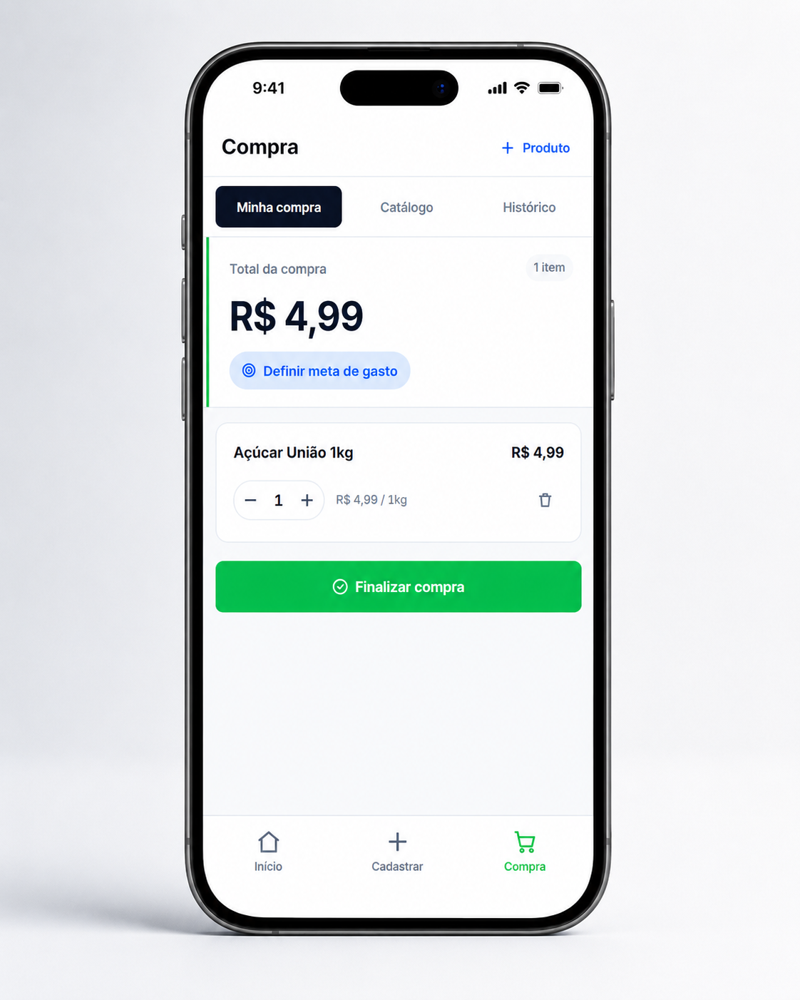
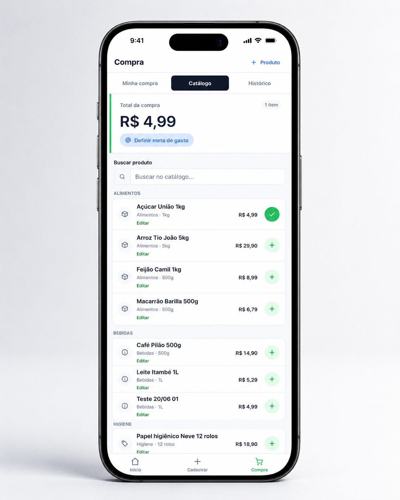
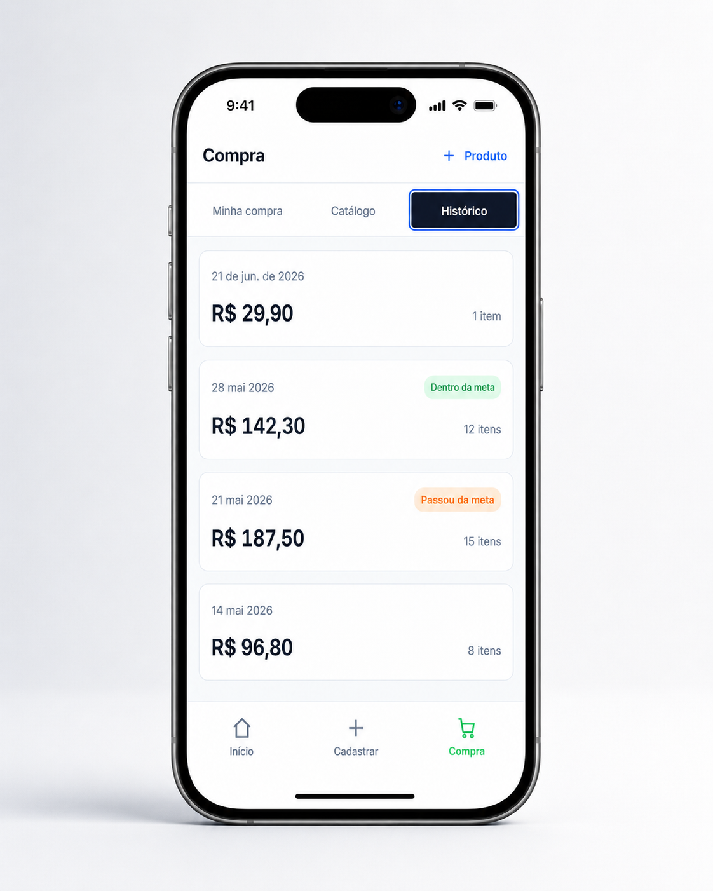
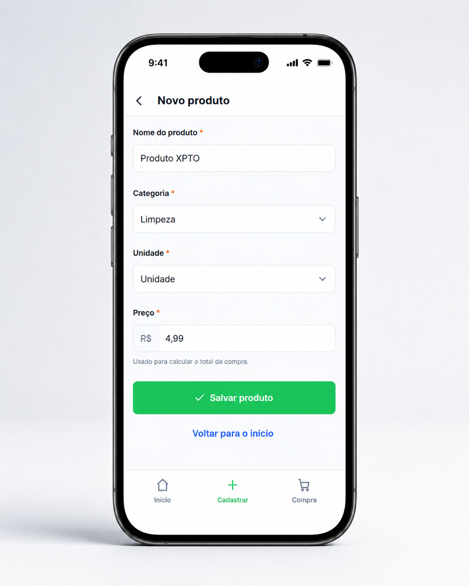

# Compra Sem Medo

> Sua compra sob controle, sem susto no caixa.

Aplicacao web mobile-first em React para auxiliar pessoas a controlar gastos durante compras de supermercado. Projeto final da disciplina de Front-End (IESB, 5o semestre).

## Funcionalidades (MVP)

- Catalogo de produtos consumido de API REST (json-server).
- Cadastro de novos produtos (formulario controlado com validacao).
- Montar uma lista de compras informando quantidade e preco unitario.
- Calculo automatico de subtotal por item e total da compra.
- Meta de gasto opcional com indicador "dentro" (verde) ou "fora" (laranja).
- Finalizar compra e historico de compras anteriores.
- Persistencia local via localStorage (dados nao somem ao fechar o navegador).
- Interface responsiva mobile-first.

Detalhes completos em [`docs/PRD.md`](docs/PRD.md).

## Telas

| Início | Minha compra | Catálogo |
| :---: | :---: | :---: |
|  |  |  |

| Histórico | Cadastro |
| :---: | :---: |
|  |  |

## Stack

- **React 19** + **Vite 8**
- **react-router v7** para rotas (`/`, `/cadastro`, `/listagem`)
- **react-hook-form** para formularios e validacao
- **Context API + useReducer** para estado compartilhado
- **Fetch API** + **json-server** para a camada REST
- **localStorage** para persistencia local
- **Vitest** + **Testing Library** para testes
- **Docker** + **Docker Compose** para o ambiente de desenvolvimento
- CSS externo com tokens do design system aprovado

## Rodar em outra maquina (do zero)

Cenario: voce chegou numa maquina nova (ex.: o PC da faculdade) e quer rodar o
projeto. Pre-requisitos: **Git** + (**Docker Desktop** OU **Node 22+**).

> ⚠️ **Nao copie a pasta por pen drive.** A `node_modules` tem binarios
> compilados para a maquina de origem e nao funcionam em outra. Sempre **clone
> e instale do zero**.

### 1. Clonar o repositorio

```bash
git clone https://github.com/guvon1982/compra-sem-medo.git
cd compra-sem-medo
```

### 2. Instalar as dependencias

```bash
npm install
```

### 3. Subir a API **e** o app (os dois!)

> 🔑 **O catalogo precisa da API (`json-server`).** Se voce rodar so o app, o
> catalogo aparece vazio com "Sem conexao com a API". Tem que ter a API no ar
> tambem.

**Com Docker (recomendado):**

```bash
docker compose up -d                    # sobe a API (json-server, porta 3000) + o container do app
docker compose exec -d app npm run dev  # inicia o Vite (porta 5173)
```

**Sem Docker:** abra **dois terminais** na pasta do projeto:

```bash
npm run api    # terminal 1 — API (json-server) na porta 3000
npm run dev    # terminal 2 — app (Vite) na porta 5173
```

### 4. Abrir no navegador

Acesse **http://localhost:5173**. O catalogo aparece com os 10 produtos do seed
(`db.json`, versionado no git).

> **O que vem junto e o que nao vem:** os 10 produtos do catalogo vem no clone
> (estao no `db.json`). Ja **compra, meta e historico comecam vazios** numa
> maquina nova — eles ficam no `localStorage` do navegador daquela maquina, nao
> no codigo. (Otimo para apresentar: comece limpo e demonstre cadastrando/
> comprando ao vivo.)

## Como rodar com Docker (recomendado)

Pre-requisitos:

- [Docker Desktop](https://www.docker.com/products/docker-desktop) instalado e rodando.

### 1. Subir o container

```bash
docker compose up -d
```

`-d` (detached) deixa o container rodando em segundo plano e devolve o terminal.

### 2. Instalar dependencias dentro do container (primeira vez)

```bash
docker compose exec app npm install
```

### 3. Iniciar o servidor de desenvolvimento

```bash
docker compose exec app npm run dev
```

Abra **http://localhost:5173** no navegador.

### 4. Rodar testes

```bash
docker compose exec app npm run test:run
```

### 5. Parar o ambiente

```bash
docker compose down
```

## Como rodar sem Docker (alternativa)

Pre-requisitos: Node 22+ instalado.

```bash
npm install
npm run dev
```

## Variaveis de ambiente

O front le variaveis com prefixo `VITE_` (padrao do Vite). A unica usada hoje:

| Variavel       | Padrao                  | Para que serve                           |
| -------------- | ----------------------- | ---------------------------------------- |
| `VITE_API_URL` | `http://localhost:3000` | URL base da API REST (sem `/` no final). |

Em desenvolvimento nao e preciso configurar nada — o codigo usa o `json-server`
local por padrao. Para apontar para outra API (ex.: em producao), copie
[`.env.example`](.env.example) para `.env` e ajuste o valor.

## Scripts disponiveis

| Comando                 | O que faz                                  |
| ----------------------- | ------------------------------------------ |
| `npm run dev`           | Servidor de desenvolvimento (HMR ativo)    |
| `npm run build`         | Gera o build de producao em `dist/`        |
| `npm run preview`       | Serve o build estaticamente para validacao |
| `npm run lint`          | Verifica o codigo com ESLint               |
| `npm test`              | Roda testes em modo watch                  |
| `npm run test:run`      | Roda testes uma vez e sai (modo CI)        |
| `npm run test:ui`       | Abre a interface grafica do Vitest         |
| `npm run test:coverage` | Roda testes com relatorio de cobertura     |

## Estrutura do projeto

```
.
├── docs/                  # PRD, SDD, design system, referencias visuais
├── public/                # Assets estaticos servidos sem processamento
├── src/
│   ├── components/        # Componentes reutilizaveis do Design System
│   ├── pages/             # Uma pasta por rota (Home, Cadastro, Listagem, NotFound)
│   ├── contexts/          # Estado global (Context + reducers puros)
│   ├── services/          # Camada de acesso a API REST (produtoService)
│   ├── storage/           # Acesso isolado ao localStorage
│   ├── utils/             # Funcoes puras (currency, catalogo)
│   ├── data/              # Constantes e mock (categorias, unidades)
│   ├── styles/            # CSS externo com tokens do design system
│   ├── test/              # Configuracao dos testes
│   ├── App.jsx            # Componente raiz com as rotas
│   └── main.jsx           # Ponto de entrada (BrowserRouter + Providers)
├── db.json                # Seed do catalogo (lido pelo json-server)
├── docker-compose.yml     # Ambiente de desenvolvimento containerizado
├── vite.config.js         # Configuracao do Vite + Vitest
└── package.json
```

Para a visao detalhada de arquitetura, fluxo de dados e modelo de dados, ver
[`docs/SDD.md`](docs/SDD.md).

## Qualidade e acessibilidade (Lighthouse)

O [Lighthouse](https://developer.chrome.com/docs/lighthouse/overview) (embutido
no Chrome DevTools) mede a qualidade da pagina em quatro eixos.

Resultado (modo **mobile**, sobre o **build de producao** — `npm run build` +
`npm run preview` em http://localhost:4173):

| Categoria      | Pontuacao |
| -------------- | :-------: |
| Performance    | 70        |
| Accessibility  | 92        |
| Best Practices | 100       |
| SEO            | 91        |

> Importante medir sobre o **build** (`preview`), nao sobre o `npm run dev`: no
> modo de desenvolvimento o codigo nao e otimizado e a Performance sai
> artificialmente baixa. Para reproduzir: `F12` → aba **Lighthouse** →
> **Analyze page load** com a app aberta no preview.

## Workflow de Git

- `main` — versoes "prontas". Recebe merge apenas no fim do projeto.
- `develop` — linha principal de desenvolvimento. Branch padrao do repositorio.
- `feature/<nome>` — uma branch por feature, sempre nascendo de `develop` e voltando para `develop` via Pull Request.

## Documentacao do projeto

- [`docs/PRD.md`](docs/PRD.md) — escopo, regras de negocio, criterios de sucesso.
- [`docs/SDD.md`](docs/SDD.md) — arquitetura, estrutura de pastas, fluxo e modelo de dados.
- [`docs/design-system-reference.md`](docs/design-system-reference.md) — tokens e regras visuais.
- [`docs/CompraSemMedo_DesignSystem_Aprovacao.png`](docs/CompraSemMedo_DesignSystem_Aprovacao.png) — referencia visual aprovada.

## Licenca

Projeto academico. Uso pessoal e educacional.
