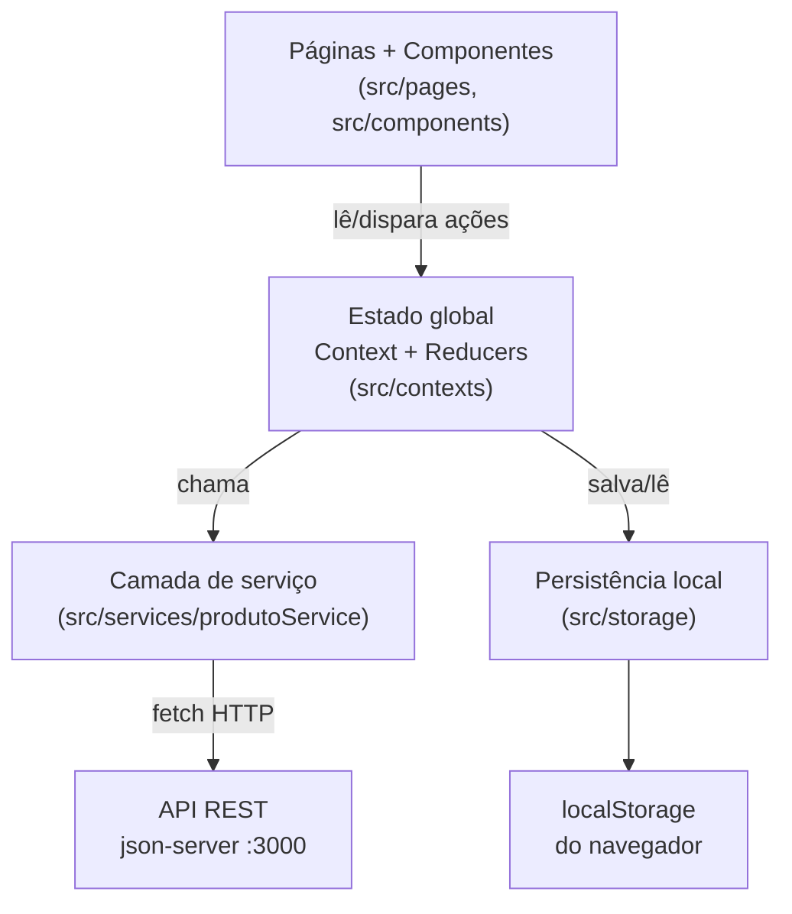
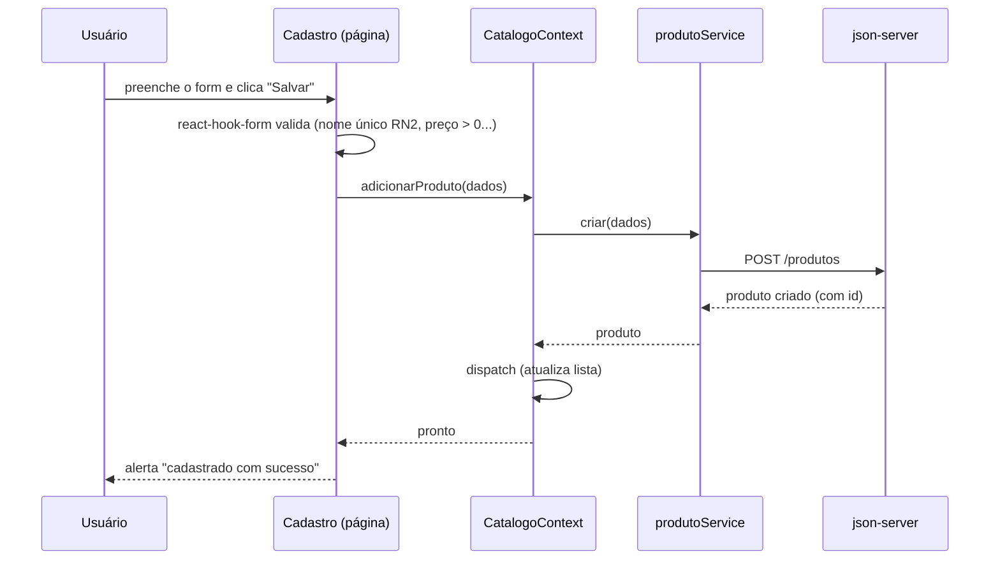

# SDD — Software Design Document

**Projeto:** Compra Sem Medo
**Tipo:** Aplicação web front-end (SPA) em React
**Autor:** guvon1982
**Status:** vivo — atualizado conforme a arquitetura evolui

> Este documento descreve **como** o projeto é construído por dentro: camadas,
> estrutura de pastas, fluxo de dados, modelo de dados e contratos. Para o
> **o quê** e o **porquê** (escopo, regras de negócio RN1–RN10, critérios de
> sucesso), ver [`PRD.md`](PRD.md).

---

## 1. Visão geral

O Compra Sem Medo é uma *Single Page Application* (SPA) — uma aplicação de
página única, em que a navegação entre telas acontece no próprio navegador, sem
recarregar a página inteira a cada clique. Ela ajuda o usuário a montar uma lista
de compras de supermercado acompanhando o total em tempo real e comparando com
uma meta de gasto opcional.

A aplicação tem **duas fontes de dados**, separadas de propósito:

| Dado | Onde mora | Por quê |
|---|---|---|
| **Catálogo de produtos** | API REST (`json-server`) | Simula um back-end real (requisito do trabalho: consumo de API). |
| **Compra atual, meta e histórico** | `localStorage` do navegador | São dados "da sessão do usuário"; não precisam de servidor e devem sobreviver a um F5. |

---

## 2. Arquitetura em camadas

O código é organizado em camadas com responsabilidades bem separadas. Cada
camada só conversa com a vizinha — isso mantém o código testável e fácil de
mudar (ex.: trocar `json-server` por uma API real mexe só na camada de serviço).



- **UI (páginas e componentes):** só apresenta dados e captura interações. Não
  fala com a rede nem com o `localStorage` diretamente.
- **Estado global (Context + Reducer):** a "fonte da verdade" compartilhada
  entre páginas. Reducers são funções puras (mesma entrada → mesma saída),
  fáceis de testar.
- **Serviço (`produtoService`):** encapsula todo `fetch` para a API. Se um dia
  a API mudar, só esta camada muda.
- **Persistência (`src/storage`):** isola o acesso ao `localStorage` em
  hooks/utilitários próprios.

---

## 3. Estrutura de pastas

```
src/
├── App.jsx                 # Define as rotas (inclui catch-all 404)
├── main.jsx                # Ponto de entrada: BrowserRouter + Providers
├── components/             # Componentes reutilizáveis do Design System
│   ├── Button/ Input/ Card/ Header/ BottomNavigation/
│   ├── ProductItem/ ShoppingListItem/ BudgetProgress/
│   ├── AlertMessage/ EmptyState/ Icon/ Logo/ Layout/
├── pages/                  # Uma pasta por rota
│   ├── Home/ Cadastro/ Listagem/ NotFound/
├── contexts/               # Estado global (Context + reducers puros)
│   ├── CatalogoContext.jsx + catalogoReducer.js
│   ├── CompraContext.jsx   + compraReducer.js
│   └── carregarEstadoInicial.js
├── services/               # Camada de acesso à API REST
│   └── produtoService.js
├── storage/                # Acesso isolado ao localStorage
│   └── useLocalStorage.js
├── utils/                  # Funções puras auxiliares
│   ├── currency.js         # parsePreco / formatBRL
│   └── catalogo.js         # normalizar / temNomeDuplicado
├── data/                   # Constantes e mock (categorias, unidades)
│   └── mock.js
├── styles/                 # CSS externo com tokens do Design System
│   ├── tokens.css base.css layout.css
└── test/                   # Configuração do Vitest
    └── setup.js
```

---

## 4. Roteamento

Quatro rotas, todas aninhadas dentro de um `Layout` comum (que exibe avisos
globais via `<Outlet />` do react-router):

| Rota | Página | Descrição |
|---|---|---|
| `/` | Home | Apresentação + resumo da compra em andamento |
| `/cadastro` | Cadastro | Criar novo produto |
| `/cadastro/:id` | Cadastro | Editar produto existente (mesma página, modo edição) |
| `/listagem` | Listagem | Abas: Minha compra · Catálogo · Histórico |
| `*` | NotFound | Catch-all: URL desconhecida → tela 404 amigável |

A aba ativa e o detalhe do histórico são guardados na **URL** (`?aba=`,
`?compra=`), então F5 e deep-link preservam onde o usuário estava.

---

## 5. Modelo de dados

### Produto (catálogo — vem da API)
```js
{
  id: "p1",              // string (gerada pelo json-server)
  nome: "Arroz Tio João 5kg",
  categoria: "Alimentos", // uma de: Alimentos, Bebidas, Higiene, Limpeza
  unidade: "5kg",
  preco: 29.9            // number
}
```

### Item da compra atual (localStorage)
Guarda só o **vínculo** (id + quantidade); nome/preço são cruzados com o
catálogo na hora de exibir. Assim, se o preço do produto mudar, a compra atual
reflete o preço novo.
```js
{ id: "p1", quantidade: 2 }
```

### Registro do histórico (localStorage)
Ao finalizar, salva um **snapshot** dos itens (congela nome/preço/categoria no
momento da compra — RN10, histórico imutável). Não depende mais do catálogo.
```js
{
  id: "h-1718900000000",
  data: "21 jun 2026",
  total: 142.30,
  meta: 150,             // ou null se não havia meta
  itens: [               // snapshot congelado
    { id, nome, categoria, unidade, preco, quantidade }
  ]
}
```

### Estado da compra (chave `csm:estado-compra` no localStorage)
```js
{
  compraAtual: [ /* itens */ ],
  meta: 60,              // ou null
  historicoCompras: [ /* registros */ ]
}
```

---

## 6. Contrato da API REST

Base configurável via `VITE_API_URL` (padrão `http://localhost:3000`). Recurso:
`/produtos`. Segue o padrão CRUD do exercício-modelo do professor (aula06).

| Função (`produtoService`) | Método HTTP | Endpoint |
|---|---|---|
| `listar()` | GET | `/produtos` |
| `obter({id})` | GET | `/produtos/:id` |
| `criar(produto)` | POST | `/produtos` |
| `atualizar({id, ...})` | PUT | `/produtos/:id` |
| `remover({id})` | DELETE | `/produtos/:id` |

Em erro de rede, o serviço **não lança exceção**: devolve `{ message: "..." }`
com texto amigável em português, e quem chamou checa o campo `message`.

---

## 7. Fluxo de dados — exemplo "cadastrar produto"



A Listagem, que lê o mesmo `CatalogoContext`, reflete o produto novo
automaticamente — é o **estado compartilhado entre páginas** exigido no enunciado.

---

## 8. Decisões técnicas principais

| Decisão | Alternativa descartada | Por quê |
|---|---|---|
| Context API + `useReducer` | Redux / Zustand | Suficiente para o tamanho do app; sem dependência extra; alinhado à aula. |
| `react-hook-form` (via `Controller`) | `useState` manual | Menos código de validação; alinhado à stack do professor. `Controller` integra o `<Input>` controlado customizado. |
| `json-server` | Back-end próprio | Foco do trabalho é o front; simula API REST real sem custo. |
| `localStorage` para a compra | Salvar tudo na API | Dado de sessão; sobrevive ao F5 sem servidor. |
| CSS externo + tokens | CSS-in-JS / Material UI | Requisito do trabalho (CSS externo); Design System próprio aprovado. |
| Snapshot no histórico | Referência por id | Histórico imutável (RN10): não muda se o produto for editado/excluído depois. |

---

## 9. Testes

- **Vitest + Testing Library**, rodando em `jsdom` (simula o navegador).
- Cobertura concentrada na **lógica pura** (reducers, `currency`, `catalogo`,
  `produtoService`) + **smoke/componente** das rotas e da validação do formulário.
- Rodam no CI (GitHub Actions) em todo PR, junto com lint e build.

---

## 10. Build e ambiente

- **Vite** empacota a aplicação (`npm run build` → `dist/`).
- **Docker Compose** sobe dois serviços em dev: `app` (Vite) e `api` (json-server).
- Variáveis de ambiente com prefixo `VITE_` são lidas pelo Vite — ver
  [`.env.example`](../.env.example).
